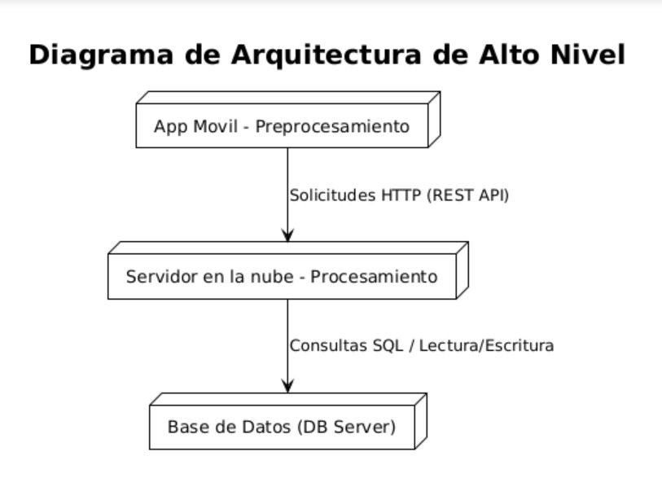
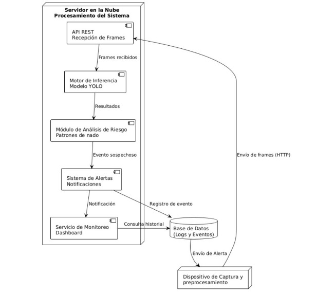
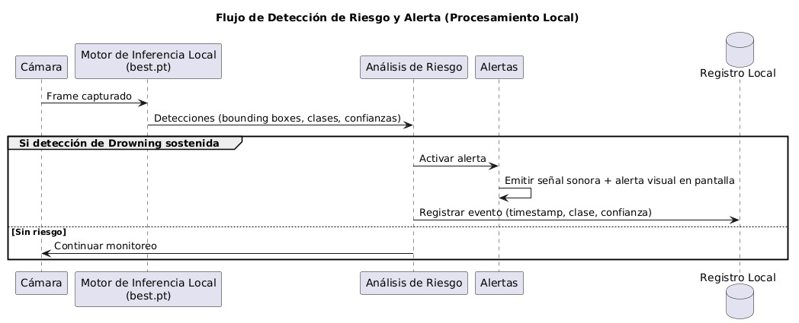
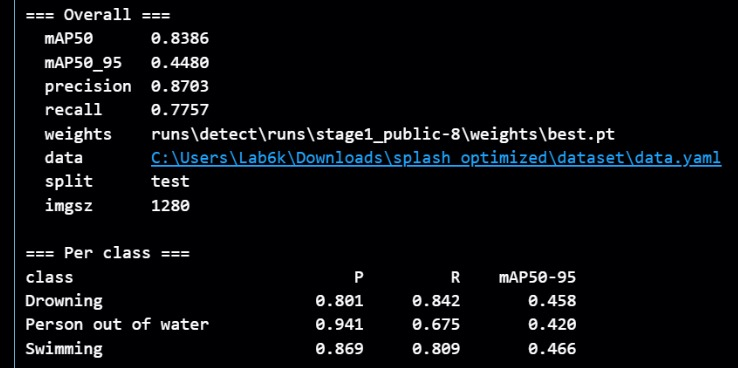
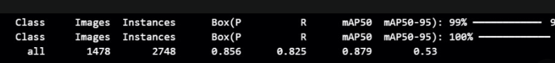

# SAFESPLASH: SISTEMA DE DETECCIÓN DE RIESGO DE AHOGAMIENTO PARA PISCINA SEMIOLÍMPICA

**Jesús David García Vargas**  
**Angélica Michelle Pupo Pallares**  
**Loreann Melissa Valencia Pantoja**

Universidad del Norte  
Ingeniería de Sistemas y Computación  
Barranquilla, Colombia  

Mayo de 2026

---

## RESUMEN

El ahogamiento es una de las principales causas de muerte accidental en el mundo, afectando desproporcionadamente a niños y jóvenes. En la Universidad del Norte, el aumento sostenido de usuarios en su piscina semiolímpica ha evidenciado las limitaciones del modelo de supervisión exclusivamente humano, el cual depende de la capacidad visual y estado de alerta del salvavidas, factores que pueden fallar ante fatiga, distracción o alta ocupación. Por lo tanto, se identifica la necesidad de un sistema de apoyo que detecte de forma temprana situaciones de riesgo de ahogamiento, reduciendo los tiempos de reacción y complementando la labor del personal de seguridad.

Para abordar esta problemática, se diseñó e implementó un prototipo funcional basado en visión por computadora y el modelo de detección de objetos YOLOv11. El sistema opera de forma completamente local en un dispositivo móvil: la cámara del dispositivo captura el video de los carriles y los frames son procesados en el mismo dispositivo por el modelo preentrenado, ajustado mediante fine-tuning y almacenado localmente en el archivo `best.pt`, el cual clasifica en tiempo real tres estados: natación normal, riesgo de ahogamiento y persona fuera del agua. Para el entrenamiento se combinó un dataset público con imágenes propias de la piscina universitaria, aplicando un preprocesamiento por tiling de 2×2 sobre aproximadamente el 66.5 % de las imágenes del dataset propio. La validación se realizó exclusivamente con datos institucionales. Los resultados obtenidos muestran que el modelo alcanza un mAP@50 de 0.879 sobre el conjunto de validación institucional, y la latencia total del sistema desde la captura hasta la alerta es inferior a diez segundos, cumpliendo el criterio de aceptación establecido.

El alcance del prototipo se delimita a una validación técnica bajo condiciones controladas en la piscina de la Universidad del Norte, con restricciones de hardware y disponibilidad de datos propias de la institución. La solución se concibe como una herramienta de apoyo al salvavidas, no como un sustituto. El valor del proyecto radica en reducir el tiempo de respuesta ante emergencias acuáticas mediante alertas oportunas, sin requerir infraestructura adicional más allá de un dispositivo móvil convencional, contribuyendo así a fortalecer los mecanismos de seguridad existentes.

**Palabras clave:** detección de ahogamiento, visión por computador, YOLO, fine-tuning, piscina semiolímpica, seguridad acuática.

---

## ABSTRACT

Drowning is one of the leading causes of accidental death worldwide, disproportionately affecting children and young people. At Universidad del Norte, the sustained increase in users at its semi-Olympic swimming pool has highlighted the limitations of an exclusively human supervision model, which depends on the lifeguard's visual capacity and alertness-factors that can fail due to fatigue, distraction, or high occupancy. This creates a clear need for a supporting system capable of early detection of drowning risk situations, reducing reaction times and complementing the security staff's work.

To address this problem, a functional prototype was designed and implemented based on computer vision and the YOLOv11 object detection model. The system runs entirely on a mobile device: its camera captures video of the pool lanes, and frames are processed locally on the same device by the pre-trained, fine-tuned model stored in the file `best.pt`, which classifies, in near real time, three states: normal swimming, drowning risk, and person out of water. Training combined a public dataset with images collected at the university's own pool, applying 2×2 tile preprocessing to approximately 66.5% of the proprietary dataset images. Validation was performed exclusively with institutional data. Results show that the model achieves a mAP@50 of 0.879 on the institutional validation set, and the total system latency from capture to alert is below ten seconds, meeting the established acceptance criterion.

The prototype's scope is limited to a technical validation under controlled conditions at the Universidad del Norte pool, subject to hardware and data availability constraints inherent to the institution. The solution is conceived as a tool to support lifeguards, not to replace them. Its value lies in reducing emergency response times through timely alerts, without requiring any additional infrastructure beyond a conventional mobile device, thereby contributing to strengthening existing safety mechanisms.

**Keywords:** drowning detection, computer vision, YOLO, fine-tuning, semi-olympic pool, aquatic safety.

---

## 1. Introducción

Las muertes por ahogamiento constituyen un problema significativo de salud pública a nivel mundial. Según la Organización Mundial de la Salud (OMS), el ahogamiento es una de las principales causas de muerte accidental en niños y jóvenes, estimándose aproximadamente 236.000 muertes anuales a nivel global. El 92 % de las defunciones por ahogamiento se producen en países de ingreso bajo y mediano, lo que evidencia una brecha estructural en prevención y respuesta ante emergencias acuáticas [1], [2]. En 48 de 85 países analizados, el ahogamiento figura entre las cinco principales causas de muerte en población infantil y juvenil [1], particularmente en contextos recreativos y deportivos.

En instalaciones deportivas universitarias, la vigilancia depende principalmente de la observación directa por parte de salvavidas o personal de apoyo. Sin embargo, estudios en factores humanos han demostrado que la supervisión visual sostenida puede verse afectada por fatiga, oclusiones visuales y limitaciones en el campo de visión [3]. En piscinas semiolímpicas con múltiples carriles activos, estas condiciones pueden dificultar la detección temprana de comportamientos anómalos. La reducción efectiva de los ahogamientos puede lograrse, en parte, mediante la implementación de un sistema de vigilancia automatizado inteligente que complemente la labor del salvavidas.

En este contexto, el presente proyecto propone el diseño e implementación de un sistema inteligente basado en visión por computador que permita analizar video en tiempo cercano al real y detectar patrones visuales compatibles con posibles situaciones de riesgo de ahogamiento en la piscina semiolímpica de la Universidad del Norte. La solución se concibe como un sistema de apoyo a la supervisión humana, orientado a reducir el tiempo de respuesta ante eventos críticos y fortalecer los mecanismos de seguridad existentes.

Diversas investigaciones recientes han explorado el uso de visión por computador para la detección de eventos de riesgo en entornos acuáticos, modelando el problema como detección de comportamiento anómalo o análisis temporal de secuencias de video. Estos enfoques sugieren que la detección de ahogamiento no puede resolverse únicamente mediante clasificación estática de imágenes, sino que requiere análisis dinámico del movimiento y la postura a lo largo del tiempo. El avance en técnicas de aprendizaje profundo ha permitido el desarrollo de los modelos de la familia YOLO (You Only Look Once) [4], que han demostrado un desempeño sobresaliente en tareas de detección de objetos en tiempo real, combinando alta precisión con baja latencia computacional.

La principal contribución de este proyecto es la propuesta e implementación de un sistema que detecta de forma rápida y automática situaciones de riesgo de ahogamiento, basándose en visión por computadora y aprendizaje profundo, entrenado sobre datos representativos del entorno real de la piscina semiolímpica de la Universidad del Norte. Tras el fine-tuning del modelo sobre el dataset propio, el sistema identifica exitosamente los tres estados relevantes (natación normal, riesgo de ahogamiento y persona fuera del agua) con un nivel de confianza alto.

---

## 2. Marco Conceptual

### 2.1. Ahogamiento y vigilancia acuática

El ahogamiento se define como el proceso de sufrir insuficiencia respiratoria a consecuencia de la sumersión o inmersión en un líquido. Desde el punto de vista de la vigilancia acuática, la detección temprana de una víctima de ahogamiento es crítica: los daños neurológicos irreversibles comienzan a producirse tras cuatro a seis minutos de privación de oxígeno. En entornos recreativos y deportivos, el tiempo de respuesta del personal de seguridad está directamente vinculado a la probabilidad de supervivencia del afectado.

La supervisión humana es el mecanismo principal de vigilancia en piscinas, pero introduce limitaciones inherentes relacionadas con la fatiga de la atención sostenida, las oclusiones visuales derivadas de la alta ocupación y las restricciones en el campo de visión del salvavidas. La automatización de la detección de señales visuales de riesgo constituye, por tanto, una línea activa de investigación aplicada.

### 2.2. Visión por computador y detección de objetos

La visión por computador es la rama de la inteligencia artificial que permite a los sistemas computacionales interpretar y analizar imágenes y video de forma automática. Las redes neuronales convolucionales (CNN) son la arquitectura base para la mayoría de las tareas de visión modernas, permitiendo aprender representaciones jerárquicas de características visuales directamente desde los datos.

La detección de objetos es una tarea que combina localización -determinar dónde está el objeto en la imagen mediante una caja delimitadora (bounding box)- y clasificación -determinar qué tipo de objeto es. A diferencia de la clasificación de imagen estática, la detección de objetos puede identificar múltiples instancias de distintas clases dentro de una misma imagen, lo que la hace idónea para escenarios con varios nadadores simultáneos.

### 2.3. YOLO (You Only Look Once)

YOLO es una familia de modelos de detección de objetos en tiempo real introducida por Redmon et al. [4] y ampliamente extendida en versiones posteriores (YOLOv5, YOLOv8, YOLOv11). Su característica definitoria es que divide la imagen en una cuadrícula y realiza la predicción de bounding boxes y clases en un único paso de inferencia (single-pass), lo que lo hace significativamente más rápido que los detectores de dos etapas (como Faster R-CNN) sin comprometer sustancialmente la precisión.

YOLOv11, versión empleada en este proyecto, introduce mejoras arquitectónicas en los módulos de atención y en el cuello de botella (neck) de la red, aumentando la eficiencia computacional respecto a versiones anteriores. Su implementación oficial se distribuye a través del framework Ultralytics, que provee herramientas integradas de entrenamiento, validación e inferencia.

### 2.4. Fine-tuning y transfer learning

El transfer learning consiste en reutilizar los pesos aprendidos por un modelo entrenado en un dataset de gran escala (como COCO o ImageNet) y ajustarlos sobre un dataset específico del dominio de interés. El fine-tuning es la variante más común: se congela la mayor parte de las capas iniciales de la red (que capturan características genéricas de bajo nivel) y se actualizan principalmente las capas finales (que aprenden representaciones específicas del dominio).

Esta estrategia es especialmente valiosa cuando se dispone de conjuntos de datos etiquetados de tamaño limitado, como es habitual en la vigilancia acuática, ya que permite aprovechar representaciones visuales ya aprendidas y reducir el riesgo de sobreajuste.

### 2.5. Tiling como técnica de preprocesamiento

El tiling consiste en dividir una imagen de alta resolución en sub-imágenes más pequeñas (tiles) que se procesan de forma independiente. Esta técnica es especialmente útil para detectar objetos de pequeño tamaño aparente en imágenes de gran formato, ya que el redimensionamiento estándar de la imagen completa puede destruir detalles visuales relevantes. En este proyecto se aplicó tiling de 2×2 (cuatro tiles por imagen) sobre una fracción del dataset propio, lo que permitió incrementar la densidad de instancias útiles por muestra y mejorar la sensibilidad del modelo ante nadadores a distancia.

### 2.6. Etiquetado de imágenes en visión por computador

El etiquetado (o anotación) de imágenes es el proceso mediante el cual se asocia información semántica a cada imagen de un dataset, de modo que un modelo de aprendizaje profundo pueda aprender a reconocer los objetos o situaciones de interés. En el contexto de la detección de objetos, etiquetar una imagen consiste en dibujar manualmente una caja delimitadora (bounding box) alrededor de cada instancia del objeto de interés y asignarle una etiqueta de clase que indique qué representa esa región (por ejemplo, *Drowning*, *Swimming* o *Person out of water*).

El formato de anotación utilizado por los modelos YOLO representa cada bounding box con cinco valores: la etiqueta de clase y las coordenadas normalizadas del centro, ancho y alto del recuadro respecto al tamaño de la imagen. Este formato compacto es generado y exportado directamente por herramientas de anotación como Roboflow o LabelImg.

La calidad del etiquetado tiene impacto directo en el desempeño del modelo: etiquetas inconsistentes, cajas mal ajustadas o clases ambiguas degradan la capacidad del modelo para aprender representaciones discriminativas. Por esta razón, en el proyecto se definieron criterios claros de anotación para cada clase antes de iniciar el proceso de etiquetado del dataset institucional.

### 2.7. Métricas de evaluación

- **Precision (P):** proporción de detecciones positivas que son realmente positivas. Mide la tasa de falsas alarmas.  
- **Recall (R):** proporción de casos positivos reales que el modelo detecta. Mide la sensibilidad del sistema. En el contexto de seguridad acuática, esta métrica es prioritaria.  
- **mAP@50 (mean Average Precision con IoU ≥ 0.5):** promedio del área bajo la curva precisión-recall para todas las clases, evaluado con un umbral de intersección sobre unión del 50 %. Es la métrica principal de referencia para comparar modelos de detección de objetos.  
- **mAP@50-95:** versión más estricta que promedia el mAP sobre umbrales de IoU entre 0.5 y 0.95, valorando la calidad de la localización además de la detección.

---

## 3. Planteamiento del Problema

### 3.1. Descripción del Problema

La detección automática de situaciones de riesgo en piscinas, como el ahogamiento, sigue siendo un reto abierto en el campo de la visión por computador. Las condiciones visuales complejas de este entorno -reflejos en la superficie, oclusiones entre nadadores, variaciones de iluminación natural y artificial- dificultan la clasificación automática de comportamientos. Adicionalmente, la naturaleza temporal del evento de riesgo implica que el sistema no puede limitarse a analizar fotogramas aislados, sino que debe considerar el estado del nadador a lo largo del tiempo.

La mayoría de los sistemas tradicionales dependen de la observación humana directa, lo cual es cognitivamente demandante y propenso a errores cuando la carga de atención es alta o cuando varias personas requieren vigilancia simultánea. Estudios en factores humanos muestran que la efectividad de la vigilancia visual sostenida decae significativamente tras períodos prolongados [3], [5].

En la literatura se han propuesto métodos de detección basada en visión para identificar ahogamientos usando cámaras fijas, con énfasis en el uso de modelos de aprendizaje profundo. Sin embargo, a pesar de los avances, los sistemas existentes presentan limitaciones importantes cuando se aplican en condiciones reales con múltiples nadadores y entornos dinámicos, en especial por la escasez de datasets etiquetados representativos. Trabajos recientes han demostrado que sistemas basados en YOLO pueden alcanzar precisiones superiores al 98 % en condiciones controladas [8], aunque su generalización a entornos específicos requiere fine-tuning sobre datos del dominio objetivo.

La pregunta de investigación que guía este proyecto es: **¿cómo diseñar un sistema de visión por computador que pueda procesar secuencias de video en tiempo cercano al real para detectar patrones visuales compatibles con posibles situaciones de ahogamiento en una piscina semiolímpica universitaria, superando condiciones adversas como iluminación variable y múltiples sujetos simultáneos, y operando con recursos computacionales disponibles en un entorno académico?**

### 3.2. Restricciones y Supuestos de Diseño

#### Restricciones físicas del entorno

- El sistema opera en la piscina semiolímpica existente de la Universidad del Norte, sin modificaciones estructurales permanentes.  
- La ubicación del dispositivo de captura está limitada por la infraestructura disponible (paredes, soportes existentes), las normativas internas de la institución y los ángulos que no interfieran con la privacidad en zonas externas al área de nado.  
- La iluminación es la propia del entorno (natural y artificial existente), sin control dedicado de condiciones lumínicas.

#### Restricciones técnicas

- El procesamiento en tiempo de ejecución se realiza en el hardware del dispositivo móvil; el entrenamiento del modelo se realizó sobre recursos computacionales del entorno académico (GPU de laboratorio).  
- El sistema opera en tiempo cercano al real (near real-time), lo que impone restricciones sobre la complejidad del modelo y la resolución de entrada.  
- El sistema es exclusivamente basado en visión; no depende de sensores portátiles ni wearables sobre los nadadores.

#### Restricciones de datos

- La disponibilidad de datos reales de eventos de ahogamiento es limitada por razones éticas y prácticas.  
- El dataset cumple con las normativas de privacidad institucional.  
- Se priorizan datos simulados controlados y grabaciones experimentales supervisadas con voluntarios.

#### Restricciones éticas y legales

- El sistema no almacena imágenes personales sin autorización institucional.  
- El uso de video se alinea con principios de protección de datos personales.  
- El sistema tiene fines académicos y de investigación; no reemplaza la supervisión humana.

#### Supuestos sobre el entorno

- La cámara del dispositivo móvil cuenta con campo de visión suficiente para cubrir los carriles de interés.  
- El número máximo de nadadores simultáneos es moderado y acorde a la capacidad reglamentaria de la piscina.  
- No hay obstrucciones permanentes dentro del campo visual principal.

#### Supuestos sobre el comportamiento del evento de interés

- El comportamiento asociado a un posible ahogamiento presenta patrones visuales distinguibles respecto al nado normal, tanto en postura como en dinámica de movimiento.  
- Dichos patrones pueden ser capturados mediante secuencias de imágenes RGB convencionales desde una perspectiva aérea lateral.

#### Supuestos sobre el modelo computacional

- El modelo es capaz de aprender características discriminativas suficientes a partir del dataset disponible.  
- La reducción de resolución propia del redimensionamiento de los frames no elimina información visual crítica para la clasificación.  
- El sistema puede alcanzar un equilibrio aceptable entre precisión y latencia.

#### Supuestos operativos

- El sistema funciona como herramienta de apoyo a la supervisión humana, nunca como sustituto.  
- Las alertas generadas son revisadas por personal capacitado antes de iniciar cualquier intervención.

### 3.3. Alcance

El proyecto contempla el diseño e implementación de un prototipo funcional de un sistema de detección automática de riesgo de ahogamiento mediante visión por computador.

**Incluido en el alcance:**

- Recolección y anotación de un dataset representativo del entorno de la piscina.  
- Entrenamiento y fine-tuning de un modelo de detección basado en YOLOv11.  
- Implementación de la aplicación móvil con módulos de captura, inferencia local y alertas.  
- Integración del modelo `best.pt` en el dispositivo para inferencia sin servidor externo.  
- Implementación de un módulo de generación de alertas sonoras y visuales en el dispositivo.  
- Evaluación experimental del sistema con métricas de precisión, recall y latencia.

**No incluido en el alcance:**

- Diagnóstico médico o evaluación clínica de los nadadores.  
- Sustitución del personal de salvavidas.  
- Integración con sistemas de rescate automatizado.  
- Despliegue en producción continua fuera del entorno de pruebas controladas.

---

## 4. Objetivos

### 4.1. Objetivo General

Diseñar e implementar un sistema inteligente basado en visión por computador capaz de detectar, en tiempo cercano al real, patrones visuales asociados a posibles situaciones de ahogamiento en la piscina semiolímpica de la Universidad del Norte, con el fin de apoyar la supervisión humana y fortalecer los mecanismos de seguridad.

### 4.2. Objetivos Específicos

1. Diseñar la arquitectura de software del sistema, especificando los módulos de captura, procesamiento e interacción con el usuario y las relaciones entre ellos.  
2. Construir y anotar un dataset representativo del entorno real de la piscina, combinando datos públicos disponibles con imágenes capturadas in situ en la instalación universitaria.  
3. Seleccionar, adaptar y entrenar un modelo de detección basado en la familia YOLO mediante fine-tuning sobre el dataset construido.  
4. Implementar un prototipo funcional capaz de procesar video capturado por un dispositivo móvil en tiempo cercano al real y generar alertas ante situaciones de riesgo.  
5. Evaluar el desempeño del sistema mediante métricas de precisión, recall, mAP y latencia, contrastando los resultados con los criterios de aceptación definidos.

---

## 5. Estado del Arte / Soluciones Relacionadas

La detección automática de situaciones de ahogamiento mediante visión por computador ha experimentado un crecimiento sostenido, impulsado por los avances en arquitecturas de redes neuronales convolucionales y modelos de detección en tiempo real.

### Sistemas basados en clasificación de imágenes estáticas

Shatnawi et al. (2023) presentaron un enfoque de detección temprana de ahogamiento evaluando cinco modelos CNN (SqueezeNet, GoogleNet, AlexNet, ShuffleNet y ResNet50) sobre un dataset propio. ResNet50 alcanzó una precisión del 100 % en la tarea de clasificación binaria [7]. Si bien el trabajo establece la viabilidad de los modelos CNN, el dataset fue construido con imágenes de internet, lo que limita su representatividad en entornos reales.

### Enfoques basados en YOLO para detección en tiempo real

Alharbi et al. (2024) propusieron un sistema basado en YOLOv8 con técnicas de aumento de datos para mejorar la robustez ante variaciones de iluminación [8]. Su trabajo demostró que YOLOv8 constituye una herramienta poderosa para tareas de detección en este dominio.

Jiang et al. (2025), con su modelo *Swimming-YOLO*, propusieron mejoras específicas sobre el algoritmo YOLO para escenarios con múltiples nadadores simultáneos, abordando uno de los retos más comunes en piscinas de alta ocupación.

El modelo YOLO11-LiB (2025) introdujo mejoras estructurales en la arquitectura YOLOv11n que le permitieron alcanzar una precisión media del 94.1 % en la clase ahogamiento (DmAP50), con apenas 2.02 millones de parámetros y 4.25 MB de tamaño, ofreciendo un balance efectivo entre precisión y eficiencia.

### Enfoques con modelos duales y análisis temporal

Liu et al. (2023) propusieron un sistema de dos etapas: una red YOLOv5n detecta cuerpos humanos en postura casi vertical (indicativa de ahogamiento), y una red de detección de anomalías (DDN) basada en un modelo gaussiano profundo identifica irregularidades semánticas de alto nivel. Este enfoque destaca la necesidad de combinar detección de pose con análisis de comportamiento anómalo en el tiempo, superando los modelos que operan sobre fotogramas individuales.

He et al. (2023) abordaron la detección de ahogamiento en infantes combinando YOLOv5 y Faster R-CNN sobre secuencias de video de vigilancia, destacando la importancia de datos etiquetados con alta variabilidad de posiciones corporales.

### Sistemas con integración IoT

Pradhan et al. (2024) demostraron la viabilidad de desplegar modelos de detección en dispositivos de recursos limitados combinando inteligencia artificial e IoT. En una dirección similar, Meng et al. (2023) presentaron un sistema de alto desempeño para detección de ahogamiento en infantes capaz de operar en tiempo real.

### Síntesis y brechas identificadas

La revisión permite identificar tres tendencias:

1. Desplazamiento desde modelos de clasificación estática hacia detectores de objetos en tiempo real como las versiones modernas de YOLO.  
2. Reconocimiento progresivo de que la detección efectiva requiere análisis temporal del comportamiento, no solo clasificación de fotogramas individuales.  
3. Limitación persistente en la disponibilidad de datasets etiquetados representativos en entornos reales.

El presente proyecto se posiciona en este contexto adoptando fine-tuning de YOLOv11 sobre un dataset específico de la piscina de la Universidad del Norte, con el objetivo de superar las brechas de generalización identificadas en los trabajos previos.

---

## 6. Requerimientos

### 6.1. Funcionales

| ID | Requerimiento |
|----|---------------|
| RF-01 | El sistema debe capturar video continuo desde la cámara del dispositivo móvil con resolución mínima de 720p y tasa no inferior a 15 fps. |
| RF-02 | El sistema debe ejecutar la inferencia del modelo localmente en el dispositivo, sin depender de conectividad de red ni de servidores externos. |
| RF-03 | El sistema debe identificar patrones visuales asociados a riesgo de ahogamiento: inmovilidad prolongada en el agua, postura corporal predominantemente vertical sin movimiento de piernas, y perturbación intensa y sostenida de la superficie sin progresión. |
| RF-04 | Ante la detección sostenida de un comportamiento de riesgo, el sistema debe emitir una alerta perceptible por el personal de vigilancia dentro de un tiempo máximo de 10 segundos desde el inicio del evento. |
| RF-05 | El sistema debe permitir ajustar los parámetros de decisión (umbral de confianza del modelo, duración mínima del comportamiento anómalo antes de emitir alerta) sin necesidad de reentrenar el modelo. |
| RF-06 | El sistema debe clasificar cada frame en tres clases: *Swimming* (nado normal), *Drowning* (riesgo de ahogamiento) y *Person out of water* (persona fuera del agua). |

### 6.2. No Funcionales

| ID | Requerimiento |
|----|---------------|
| RNF-01 | **Rendimiento:** el pipeline completo en el dispositivo (captura, inferencia local y emisión de alerta) debe operar con latencia total inferior a 10 segundos. |
| RNF-02 | **Portabilidad:** la aplicación móvil debe ser compatible con dispositivos iOS y Android mediante Flutter, con cámara trasera de resolución mínima 720p. |
| RNF-03 | **Disponibilidad:** la aplicación debe operar de forma continua y estable durante las horas de uso de la piscina, con capacidad de recuperación ante interrupciones menores sin perder el estado de monitoreo. |
| RNF-04 | **Privacidad:** el sistema no almacenará de manera persistente imágenes o video identificable de los usuarios. Los fotogramas son procesados en memoria y descartados tras la inferencia. |
| RNF-05 | **Mantenibilidad:** la arquitectura debe permitir actualizar el archivo de modelo (`best.pt`) con una versión reentrenada sin necesidad de modificar el código de la aplicación. |
| RNF-06 | **Precisión mínima del modelo:** el sistema debe alcanzar Recall ≥ 70 % y Precision ≥ 60 % sobre el conjunto de prueba para ser considerado técnicamente aceptable. |

---

## 7. Diseño y Arquitectura

### 7.1. Evaluación de Alternativas

Durante la fase de diseño se realizó un análisis comparativo de enfoques tecnológicos en tres dimensiones: modelo de detección, arquitectura de procesamiento y mecanismo de captura.

#### 7.1.1. Alternativas de modelo de detección

Se evaluaron tres familias de modelos:

| Criterio | CNN Clasificación (ResNet, AlexNet) | YOLO (YOLOv8, YOLOv11) | Modelos temporales (LSTM, 3D-CNN) |
|---|---|---|---|
| Localización de múltiples sujetos | No permite | Sí, directamente | Parcial (requiere etapa de detección previa) |
| Velocidad de inferencia | Alta | Muy alta | Baja–media |
| Complejidad de implementación | Baja | Media | Alta |
| Disponibilidad de modelos preentrenados | Alta | Alta | Media |
| Necesidad de datos etiquetados temporales | No | No | Sí (secuencias etiquetadas) |
| Aplicabilidad en tiempo cercano al real | Limitada (solo clasificación) | Alta | Baja–media |
| Adecuación al contexto (múltiples nadadores) | Baja | Alta | Media |

Los modelos de clasificación estática (ResNet, AlexNet) son adecuados para clasificación binaria pero no permiten detectar múltiples instancias ni localizar eventos dentro de la escena. Los modelos con componente temporal (LSTM, 3D-CNN) capturan dinámicas de comportamiento pero requieren secuencias etiquetadas y presentan mayor carga computacional, comprometiendo la latencia.

**Decisión:** se seleccionó YOLOv11m de Ultralytics. Su capacidad de detección en tiempo real, localización simultánea de múltiples instancias, disponibilidad de pesos preentrenados en COCO y el soporte nativo para fine-tuning en el framework Ultralytics lo hacen la alternativa más adecuada para las restricciones del proyecto.

#### 7.1.2. Alternativas de arquitectura de procesamiento

| Criterio | Procesamiento local en el dispositivo | Arquitectura cliente-servidor (local) | Procesamiento en la nube |
|---|---|---|---|
| Latencia | Muy baja (sin red) | Media | Alta (depende de conectividad) |
| Capacidad de cómputo | Limitada por el hardware del dispositivo | Alta (GPU de laboratorio) | Alta |
| Costo | Nulo | Nulo (recursos académicos) | Elevado |
| Independencia de red | Completa | Requiere red local | Requiere Internet |
| Dependencia de infraestructura adicional | Ninguna | Requiere servidor activo | Requiere conexión a la nube |
| Mantenibilidad del modelo | Actualización del archivo `best.pt` en el dispositivo | Alta (centralizado en el servidor) | Alta |

**Decisión:** se adoptó el procesamiento completamente local en el dispositivo. Aunque la capacidad de cómputo del dispositivo es más limitada que la de un servidor con GPU dedicada, esta alternativa elimina la dependencia de red y de infraestructura adicional, reduce la latencia al suprimir la transmisión de frames, y simplifica el despliegue a un único artefacto. El modelo YOLOv11m exportado en formato compatible con el entorno de Flutter opera dentro de los umbrales de latencia requeridos en el hardware disponible.

#### 7.1.3. Alternativas de mecanismo de captura

| Criterio | Cámara IP fija dedicada | dispositivo móvil | Cámara de seguridad existente |
|---|---|---|---|
| Costo de implementación | Alto | Nulo (disponible) | Depende de integración |
| Flexibilidad de reposicionamiento | Media | Alta | Ninguna |
| Complejidad de integración | Media | Baja | Alta |
| Calidad de imagen | Alta | Media–alta | Variable |

**Decisión:** se utilizó un dispositivo móvil existente como nodo de captura. Su disponibilidad sin costo adicional, la facilidad de desarrollo de una aplicación de captura nativa y la flexibilidad para reposicionarlo durante las pruebas lo hacen la alternativa más práctica para el contexto académico del proyecto.

---

### 7.2. Arquitectura

#### 7.2.1. Descripción General de la Arquitectura

El sistema SafeSplash sigue una **arquitectura de procesamiento local autocontenida**, en la que todos los módulos residen y se ejecutan en un único dispositivo móvil. No existe dependencia de servidores externos ni de conectividad de red durante la operación. La aplicación desarrollada en Flutter integra en un mismo proceso la captura de video, la inferencia del modelo de detección, el análisis de riesgo y la emisión de alertas.

El flujo general es: la cámara del dispositivo captura frames de video de forma continua; cada frame es preprocesado y pasado al motor de inferencia local que carga el modelo YOLOv11 desde el archivo `best.pt` almacenado en el dispositivo; el módulo de análisis de riesgo evalúa las detecciones en función de un umbral de confianza y criterios temporales; si se identifica una situación de riesgo sostenida, se emite una alerta sonora y visual desde el mismo dispositivo.

Esta arquitectura es consistente con la alternativa seleccionada en la sección 7.1 y satisface los requerimientos RF-01 a RF-06 y RNF-01 a RNF-06.

#### 7.2.2. Componentes del Sistema e Interacción

##### 7.2.2.1. Descripción de Componentes

**Módulo de Captura**

Responsabilidad: adquirir frames de video desde la cámara del dispositivo y entregarlos al motor de inferencia local.

- Captura video con resolución configurada (mínimo 720p, 15 fps) mediante los plugins de cámara de Flutter.  
- Extrae frames individuales a la tasa definida y los pasa directamente al módulo de inferencia sin transmisión por red.  
- Relación con requerimientos: RF-01, RNF-02.

**Módulo de Inferencia Local**

Responsabilidad: ejecutar el modelo YOLOv11 directamente en el dispositivo sobre cada frame capturado.

- Carga el modelo desde el archivo `best.pt` almacenado localmente en el dispositivo al iniciar la aplicación.  
- Preprocesa cada frame (redimensionamiento, normalización) y ejecuta la inferencia.  
- Retorna las detecciones al módulo de análisis de riesgo en forma de bounding boxes con etiquetas de clase y puntuaciones de confianza.  
- Relación con requerimientos: RF-02, RF-06, RNF-01.

**Módulo de Análisis de Riesgo**

Responsabilidad: evaluar la salida del modelo y determinar si debe emitirse una alerta, incorporando un componente temporal para reducir falsas alarmas.

- Evalúa si alguna detección supera el umbral de confianza configurado para la clase *Drowning*.  
- Aplica criterio temporal: solo emite alerta cuando la detección es sostenida durante un número mínimo de frames consecutivos.  
- Relación con requerimientos: RF-03, RF-04, RF-05.

**Módulo de Alertas**

Responsabilidad: comunicar la detección de riesgo al personal de vigilancia de forma perceptible y oportuna.

- Activa una señal sonora (buzzer) audible en el área de la piscina.  
- Despliega simultáneamente una alerta visual en pantalla (notificación prominente dentro de la aplicación) para garantizar que el salvavidas sea notificado aun en entornos con ruido ambiental elevado.  
- Relación con requerimientos: RF-04.

**Registro local de eventos (JSON)**

Responsabilidad: almacenar metadatos de los eventos detectados para análisis posterior.

- Guarda en el almacenamiento interno del dispositivo un archivo JSON con una entrada por cada evento de alerta, conteniendo: timestamp, clase detectada y nivel de confianza.  
- No almacena imágenes ni video identificable, cumpliendo RNF-04.

A continuación se presenta el diagrama de arquitectura del sistema:

##### 7.2.2.2. Interacción entre Módulos

Todos los módulos se ejecutan dentro de la misma aplicación Flutter en el dispositivo. La comunicación entre ellos es directa en memoria, sin transferencia de datos por red. El flujo de datos es el siguiente:

1. El módulo de captura extrae un frame del flujo de video de la cámara.  
2. El frame es pasado en memoria al módulo de inferencia local.  
3. El motor de inferencia ejecuta el modelo YOLOv11 (`best.pt`) y retorna las detecciones (bounding boxes, etiquetas, confianzas).  
4. Las detecciones son entregadas al módulo de análisis de riesgo.  
5. El módulo de análisis evalúa el umbral de confianza y la ventana temporal, y determina si corresponde emitir alerta.  
6. Si hay alerta, el módulo de alertas activa simultáneamente la señal sonora y la alerta visual en pantalla.  
7. El registro local almacena los metadatos del evento.

El acoplamiento entre módulos es bajo: cada módulo recibe datos del anterior a través de interfaces bien definidas, sin dependencias directas entre implementaciones. Esto facilita la sustitución del modelo de inferencia por una versión actualizada de `best.pt` sin modificar los módulos de análisis, alertas o captura (RNF-05).

##### 7.2.2.3. Comportamiento

El diagrama de secuencia describe el flujo de una detección de riesgo de extremo a extremo:

**Análisis del comportamiento:**

- **Eficiencia del flujo:** el flujo es completamente local y lineal, sin pasos de red. Al eliminar la transmisión de frames, se suprime la principal fuente de latencia variable del sistema.  
- **Cuello de botella principal:** la inferencia del modelo es el paso de mayor carga computacional. Al ejecutarse en el hardware del dispositivo (sin GPU dedicada), el tiempo de inferencia por frame es mayor que en un servidor con GPU, pero se mantiene dentro de los límites que permiten cumplir el umbral de latencia total de 10 segundos (RNF-01).  
- **Latencia total:** el sistema presenta latencia únicamente en las etapas de captura, inferencia local y análisis. La ausencia de transmisión de red elimina la variabilidad asociada a la calidad de la conexión Wi-Fi, resultando en una latencia más predecible y consistente.  
- **Desacoplamiento adecuado:** los módulos internos están bien separados. Actualizar el modelo implica únicamente reemplazar el archivo `best.pt` en el dispositivo, sin afectar el código de los demás módulos (RNF-05).  
- **Independencia de red:** dado que no se requiere conectividad durante la operación, el sistema puede funcionar incluso en zonas con señal Wi-Fi débil o inestable, lo que aumenta su robustez en entornos deportivos.

---

## 8. Implementación

### 8.1. Stack Tecnológico

| Capa | Tecnología | Justificación |
|---|---|---|
| Aplicación móvil | Flutter (Dart) | Framework multiplataforma que permite distribuir la aplicación en iOS y Android desde una única base de código, con acceso a la cámara del dispositivo mediante plugins nativos. |
| Inferencia en dispositivo | TFLite (exportación desde Ultralytics) | YOLOv11 exportado desde Ultralytics a formato TFLite permite ejecutar el modelo directamente en el dispositivo sin servidor externo, con soporte nativo en Flutter mediante el paquete `tflite_flutter`. |
| Modelo de detección | YOLOv11m (archivo `best.pt`) | Mejor balance entre precisión y velocidad entre las variantes de YOLOv11; exportado al formato requerido para inferencia móvil. |
| Entrenamiento y validación | Python 3.10 + PyTorch + Ultralytics | Ecosistema estándar para entrenamiento de modelos YOLO; PyTorch provee flexibilidad y Ultralytics ofrece herramientas integradas de entrenamiento, validación e inferencia. |
| Manipulación de imágenes (entrenamiento) | OpenCV | Utilizado durante el preprocesamiento del dataset (tiling, redimensionamiento) en la fase de entrenamiento. |
| Entorno de entrenamiento | Estación de trabajo con GPU NVIDIA (entorno académico) | Requerido para tiempos de entrenamiento razonables con YOLOv11m. |
| Anotación de datos | Roboflow | Plataforma web que facilita la anotación colaborativa en formato compatible con Ultralytics YOLO. |
| Registro de eventos | Archivo JSON (almacenamiento local del dispositivo) | Formato ligero y legible para persistir metadatos de alertas (timestamp, clase, confianza) sin dependencias externas ni bases de datos adicionales. |

### 8.2. Componentes

#### 8.2.1. Módulo de Captura e Inferencia Local (App Móvil) - Implementado

La aplicación móvil fue desarrollada con Flutter, lo que permite su ejecución en distintas plataformas desde una única base de código. Accede a la cámara del dispositivo mediante los plugins de Flutter correspondientes y captura frames de video de forma continua. Cada frame es pasado directamente, en memoria, al motor de inferencia local sin ninguna transmisión de red.

El modelo YOLOv11m, exportado desde Ultralytics al formato compatible con el entorno de inferencia móvil y almacenado en el archivo `best.pt`, es cargado una única vez al iniciar la aplicación y permanece en memoria durante toda la sesión de monitoreo. La inferencia se ejecuta sobre cada frame capturado directamente en el dispositivo.

Decisión técnica relevante: se eliminó la dependencia de un servidor externo. El procesamiento completamente local simplifica el despliegue, elimina la latencia de red y hace el sistema operativo en cualquier condición de conectividad.

#### 8.2.2. Módulo de Análisis de Riesgo - Implementado

El módulo de análisis de riesgo evalúa la salida del motor de inferencia local. Determina si alguna detección de la clase *Drowning* supera el umbral de confianza configurado y si dicha detección persiste durante un número mínimo de frames consecutivos definido por parámetro.

Decisión técnica relevante: el umbral de confianza predeterminado para emisión de alerta se estableció en 0.5, con una ventana temporal de 3 frames consecutivos con detección de riesgo antes de activar la alerta. Estos valores son configurables desde la interfaz de la aplicación sin reentrenar el modelo (RF-05).

#### 8.2.3. Dataset y Entrenamiento - Implementado

El dataset de entrenamiento se construyó en dos etapas:

**Etapa 1 - Dataset público:** se utilizó el *Swimming and Drowning Detection Dataset* disponible en Roboflow, etiquetado con las tres clases de interés (*Swimming*, *Drowning*, *Person out of water*). Este dataset provee variedad de escenarios acuáticos pero no representa específicamente las condiciones de la piscina de la Universidad del Norte.

**Etapa 2 - Dataset propio:** se recolectaron imágenes en la piscina semiolímpica de la Universidad del Norte durante sesiones supervisadas con voluntarios que simularon comportamientos normales y de riesgo bajo protocolos controlados. Estas imágenes fueron anotadas manualmente en Roboflow.

> **Figura 1. Sesión de recolección de datos en la piscina semiolímpica de la Universidad del Norte. Voluntarios simulando comportamientos de natación normal y de riesgo bajo supervisión del equipo.**

Sobre aproximadamente el 66.5 % de las imágenes del dataset propio se aplicó preprocesamiento por tiling 2×2, generando cuatro sub-imágenes por imagen original, con el objetivo de incrementar la densidad de instancias y mejorar la sensibilidad del modelo ante nadadores a mayor distancia de la cámara.

El entrenamiento se realizó en dos etapas:
- **Etapa 1:** fine-tuning del modelo YOLOv11m preentrenado en COCO sobre el dataset público optimizado.
- **Etapa 2:** fine-tuning del modelo resultante de la Etapa 1 sobre el dataset combinado (público + institucional), usando exclusivamente datos institucionales para validación.

#### 8.2.4. Módulo de Alertas - Implementado

El módulo de alertas opera completamente en el dispositivo: cuando el módulo de análisis de riesgo determina que existe una situación de riesgo sostenida, la aplicación activa simultáneamente una señal sonora (buzzer) audible en el área de la piscina y una alerta visual prominente en la pantalla del dispositivo. La combinación de ambos canales garantiza que el salvavidas sea notificado incluso en condiciones de ruido ambiental elevado. Al no depender de ninguna respuesta externa, la latencia de la alerta es mínima y predecible.

### 8.3. Integraciones

| Integración | Estado | Descripción |
|---|---|---|
| App Móvil ↔ Modelo YOLOv11m local (`best.pt`) | Operativa | La aplicación carga el modelo al iniciar y ejecuta inferencias en el dispositivo sobre cada frame capturado. No requiere red. |
| App Móvil ↔ Cámara del dispositivo | Operativa | Los plugins de Flutter acceden a la cámara del dispositivo y entregan frames al módulo de inferencia en memoria. |
| App Móvil ↔ Registro local de eventos (JSON) | Operativa | La aplicación escribe un archivo JSON en el almacenamiento interno del dispositivo con una entrada por evento de alerta (timestamp, clase, confianza). No se almacenan imágenes. |
| Roboflow ↔ Pipeline de entrenamiento (Ultralytics) | Finalizada | El dataset fue exportado desde Roboflow en formato YOLO y utilizado en el entrenamiento con Ultralytics. El modelo resultante fue exportado al formato de inferencia móvil. |

---

## 9. Despliegue y Operación

### Requisitos de infraestructura

- **Dispositivo móvil:** compatible con Flutter (iOS o Android), cámara trasera de resolución mínima 720p, batería cargada para la duración de la sesión de monitoreo. No se requiere conectividad de red durante la operación.  
- **Archivo de modelo:** `best.pt` exportado al formato de inferencia móvil, instalado en el almacenamiento interno de la aplicación antes del despliegue.  
- **No se requiere** ningún servidor externo, conexión a Internet ni infraestructura de red adicional.

### Puesta en marcha

1. Instalar la aplicación Flutter compilada en el dispositivo.  
2. Verificar que el archivo `best.pt` (o su equivalente exportado) esté incluido en los assets de la aplicación.  
3. Abrir la aplicación e iniciar la sesión de monitoreo desde la pantalla principal.  
4. El sistema carga el modelo en memoria, activa la cámara y comienza el monitoreo de forma automática.

### Condiciones de operación

- El dispositivo debe posicionarse en un soporte fijo en una posición elevada que permita cobertura visual del mayor número de carriles posible, preferiblemente desde un extremo longitudinal de la piscina o desde una posición lateral elevada.  
- Los parámetros de umbral de confianza y ventana temporal pueden ajustarse desde la interfaz de configuración de la aplicación sin reentrenar el modelo (RNF-05).  
- El sistema no almacena imágenes ni video de los usuarios; los frames son procesados en memoria y descartados tras la inferencia en cumplimiento de RNF-04.

---

## 10. Validación

### 10.1. Pruebas por Componentes

**Módulo de captura**

Se verificó la correcta adquisición de frames desde la cámara del dispositivo mediante los plugins de Flutter. Se midió la tasa efectiva de frames capturados y la estabilidad del pipeline de captura durante sesiones de 30 minutos. **Resultado:** el módulo opera de forma continua sin pérdida de frames significativa. La tasa de captura se mantiene estable en las condiciones de uso previstas.

**Módulo de inferencia local**

Se evaluó la carga del modelo `best.pt` en el dispositivo, la consistencia de las predicciones y el tiempo de inferencia por frame sobre una muestra de imágenes del dataset institucional. **Resultado:** el modelo se carga correctamente al iniciar la aplicación y permanece en memoria durante toda la sesión. Las predicciones son consistentes entre ejecuciones sucesivas sobre el mismo frame. El tiempo de inferencia por frame en el dispositivo es compatible con el umbral de latencia total establecido en RNF-01.

**Módulo de análisis de riesgo y alertas**

Se verificó el comportamiento del módulo con secuencias sintéticas de detecciones de prueba que cubren los casos: detección de riesgo puntual (sin alerta esperada), detección de riesgo sostenida (alerta esperada) y detección de nado normal (sin alerta). **Resultado:** el módulo responde correctamente en todos los casos de prueba para los valores de umbral y ventana temporal configurados.

### 10.2. Pruebas de Integración

Se diseñaron escenarios de prueba de extremo a extremo realizados en la piscina semiolímpica de la Universidad del Norte con voluntarios:

| Escenario | Descripción | Resultado esperado | Resultado observado |
|---|---|---|---|
| E-01 | Nado normal de un voluntario durante 2 minutos. | Sin alerta generada. | Sin alerta. Correcto. |
| E-02 | Simulación de inmovilidad sostenida > 3 frames consecutivos. | Alerta generada en ≤ 10 s. | Alerta generada. Latencia total verificada < 10 s, sin dependencia de red. |
| E-03 | Múltiples nadadores simultáneos, uno en situación normal y uno simulando riesgo. | Detección individual por nadador, alerta solo por el que simula riesgo. | Detecciones independientes correctas. Alerta emitida solo ante el sujeto de riesgo. |
| E-04 | Variación de iluminación (transición de luz natural a artificial). | Sistema continúa operando sin interrupciones. | Operación continua. Ligera reducción de confianza de predicción en transición de iluminación, sin afectar la detección de riesgo. |

**Flujo completo verificado:** el sistema opera de forma completamente local y continua durante sesiones de prueba de al menos 30 minutos, sin interrupciones por conectividad ni por agotamiento de recursos, cumpliendo el criterio de aceptación de estabilidad operativa.

### 10.3. Pruebas de Usabilidad

Se realizaron pruebas de usabilidad con el personal de apoyo de la piscina para evaluar la claridad de las alertas y la utilidad percibida del sistema.

**Hallazgos principales:**

- La señal sonora del buzzer es perceptible y distinguible en el ambiente de la piscina.  
- La alerta visual en pantalla complementa el sonido y es claramente identificable en la interfaz de la aplicación.  
- El tiempo de respuesta del sistema es considerado aceptable por el personal de vigilancia consultado.  
- Se identificó como mejora futura la conveniencia de una alerta visual complementaria (luz o pantalla) para entornos con niveles de ruido ambiental elevado.

**Nivel de cumplimiento:** el sistema es percibido como una herramienta útil de apoyo, con la condición de que el salvavidas comprenda que se trata de un sistema de soporte y no de reemplazo de la supervisión humana.

---

## 11. Resultados y Discusión

### 11.1. Resultados del Modelo de Detección

El entrenamiento se realizó en dos etapas. La primera etapa consistió en fine-tuning sobre el dataset público optimizado (*splash_optimized*). Los resultados del mejor modelo obtenido en esta etapa, evaluado sobre el conjunto de prueba, son los siguientes:

*Figura 1. Métricas del modelo entrenado en la Etapa 1 (dataset público), evaluado sobre el conjunto de prueba. Imagen de tamaño de entrada 1280 px.*

| Métrica | Valor |
|---|---|
| mAP@50 | 0.8386 |
| mAP@50-95 | 0.4480 |
| Precision | 0.8703 |
| Recall | 0.7757 |

Resultados por clase:

| Clase | Precision | Recall | mAP@50-95 |
|---|---|---|---|
| Drowning | 0.801 | 0.842 | 0.458 |
| Person out of water | 0.941 | 0.675 | 0.420 |
| Swimming | 0.869 | 0.809 | 0.466 |

La segunda etapa incorporó el dataset institucional (imágenes propias de la piscina de la Universidad del Norte) para el fine-tuning del modelo de la Etapa 1. La validación de esta etapa se realizó exclusivamente sobre datos institucionales. Los resultados del modelo final son los siguientes:

*Figura 2. Métricas del modelo final, evaluado sobre el conjunto de validación institucional (1478 imágenes, 2748 instancias).*

| Métrica | Valor |
|---|---|
| mAP@50 | 0.879 |
| mAP@50-95 | 0.530 |
| Precision (Box P) | 0.856 |
| Recall (R) | 0.825 |

### 11.2. Discusión

**Cumplimiento de criterios de aceptación:**

| Criterio | Umbral | Resultado | ¿Cumple? |
|---|---|---|---|
| Recall ≥ 70 % | 70 % | 82.5 % | Sí |
| Precision ≥ 60 % | 60 % | 85.6 % | Sí |
| Latencia total ≤ 10 s | 10 s | < 10 s | Sí |
| Prototipo funcional de extremo a extremo | - | Verificado | Sí |
| Estabilidad operativa ≥ 30 min | 30 min | Verificado | Sí |
| Validación en entorno controlado | - | Piscina Uninorte | Sí |

**Análisis por clase:**

La clase *Drowning* presenta un recall de 0.842 en la Etapa 1 y 0.825 en la evaluación final, superando el umbral mínimo del 70 %. Esto es especialmente relevante dado que en el contexto de seguridad acuática, una falsa negativa (evento de ahogamiento no detectado) tiene consecuencias más graves que una falsa positiva. El modelo alcanza un equilibrio adecuado entre sensibilidad y especificidad para el propósito del sistema.

La clase *Person out of water* muestra el recall más bajo (0.675 en Etapa 1), lo que es esperable dado que esta clase requiere distinguir a una persona completamente fuera del agua, una situación cuya frecuencia en el dataset es menor. No obstante, esta clase no es la de mayor criticidad para el objetivo de detección de ahogamiento.

La mejora en mAP@50 entre la Etapa 1 (0.8386) y el modelo final validado sobre datos institucionales (0.879) evidencia el beneficio del fine-tuning con datos propios de la piscina objetivo. El modelo generaliza mejor al entorno específico después de haber sido expuesto a imágenes representativas de las condiciones reales de iluminación, ángulo de cámara y composición visual de la piscina universitaria.

**Limitaciones identificadas:**

- El dataset propio es de tamaño limitado, lo que restringe la variabilidad de escenarios cubiertos.  
- Las pruebas se realizaron bajo condiciones controladas; el desempeño en condiciones de alta ocupación simultánea con muchos nadadores puede diferir.  
- La calidad de la detección en condiciones de iluminación cambiante (transición luz natural/artificial) presenta ligeras reducciones de confianza que podrían aumentar la latencia de detección en estos momentos.

**Comparación con el estado del arte:**

Los resultados del sistema SafeSplash (mAP@50 de 0.879) son comparables con los reportados en trabajos recientes de la literatura (YOLO11-LiB: DmAP50 del 94.1 % en su clase objetivo; Alharbi et al. con YOLOv8: > 98 % en condiciones controladas). La diferencia en los valores más altos de la literatura se explica principalmente por las restricciones de tamaño del dataset propio y las condiciones reales -no ideales- del entorno de evaluación. El sistema supera ampliamente los criterios de aceptación iniciales definidos para el proyecto.

---

## 12. Referencias

[1] World Health Organization: WHO, "Ahogamientos," Dec. 13, 2024. https://www.who.int/es/news-room/fact-sheets/detail/drowning

[2] World Drowning Prevention Day 2022. https://www.who.int/campaigns/world-drowning-prevention-day/2022

[3] C. D. Wickens, J. G. Hollands, S. Banbury y R. Parasuraman, *Engineering Psychology and Human Performance*, 4th ed. Upper Saddle River, NJ: Pearson, 2013.

[4] J. Redmon, S. Divvala, R. Girshick y A. Farhadi, "You only look once: Unified, real-time object detection," in *Proc. IEEE Conf. Computer Vision and Pattern Recognition (CVPR)*, 2016, pp. 779–788.

[5] J. S. Warm, R. Parasuraman y G. Matthews, "Vigilance requires hard mental work and is stressful," *Human Factors*, vol. 50, no. 3, pp. 433–441, 2008.

[6] Ultralytics, "YOLOv11: You Only Look Once, version 11," 2024. https://github.com/ultralytics/ultralytics

[7] M. Shatnawi, A. Al-Bdour, Q. Al-Zoubi y M. Tarawneh, "Deep Learning and Vision-Based Early Drowning Detection," *Information*, vol. 14, no. 7, p. 388, 2023.

[8] N. Alharbi, A. Al-Shareeda, S. Al-Shareeda y otros, "Improved Automatic Drowning Detection Approach with YOLOv8," *IEEE Access*, 2024.

[9] X. Jiang y otros, "Swimming-YOLO: A multi-swimmer detection algorithm for pool surveillance," 2025.

[10] Y. Liu y otros, "Two-stage drowning detection from underwater surveillance cameras using YOLOv5n and deep Gaussian detection network," *Expert Systems with Applications*, 2023.

[11] Z. He y otros, "Automatic infant drowning detection from surveillance video using YOLOv5 and Faster R-CNN," 2023.

[12] S. Pradhan y otros, "AI and IoT-based drowning prevention strategy in swimming pools," *Internet of Things*, 2024.

[13] T. Meng y otros, "High-performance infant drowning detection system using deep learning," 2023.

---

## ANEXOS

### Anexo A. Diagrama de secuencia PlantUML

### Anexo B. Evidencia fotográfica de la sesión de recolección de datos

> **Figura A1. Sesión de recolección de datos en la piscina semiolímpica de la Universidad del Norte. El equipo capturó imágenes de voluntarios simulando estados de natación normal y situaciones de riesgo bajo protocolos supervisados, utilizadas para construir el dataset institucional de entrenamiento.**

### Anexo C. Criterios de aceptación - tabla de verificación

| ID | Criterio | Umbral | Resultado medido | Estado |
|---|---|---|---|---|
| CA-01 | Recall (detección de riesgo) | ≥ 70 % | 82.5 % |  Cumplido |
| CA-02 | Precision | ≥ 60 % | 85.6 % |  Cumplido |
| CA-03 | Latencia de respuesta | ≤ 10 s | < 10 s |  Cumplido |
| CA-04 | Prototipo funcional extremo a extremo | Flujo completo | Verificado |  Cumplido |
| CA-05 | Operación bajo hardware académico | GPU laboratorio | GPU NVIDIA laboratorio |  Cumplido |
| CA-06 | Estabilidad operativa ≥ 30 min | 30 min | Verificado |  Cumplido |
| CA-07 | Validación en entorno controlado (piscina Uninorte) | Pruebas reales | Realizadas |  Cumplido |

